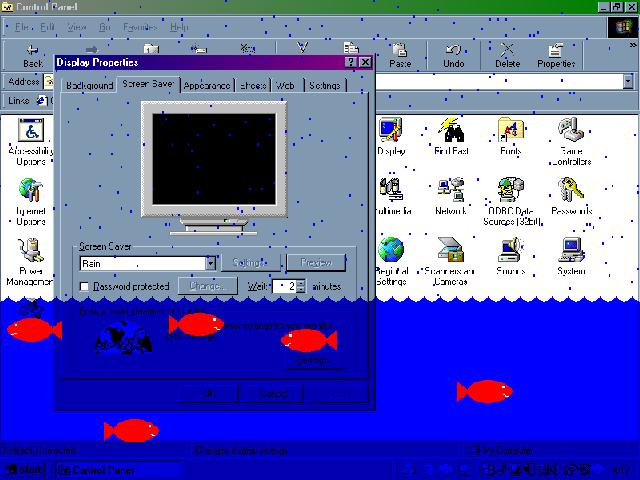



## Screen Saver \(re\-submitted\)

### Description

An almost-complete screen saver that fills your screen with (transperent) water and lets fish swim around. Uses bitblt and is fairly fast. Not customizable (yet) and designed for 800x600 res. Take a look.

(I left out a module last submit)
 
### More Info
 

             |
---                |---
**Submitted On**   |2000-11-17 14:21:06
**By**             |[JoshD](https://github.com/Planet-Source-Code/PSCIndex/blob/master/ByAuthor/joshd.md)
**Level**          |Intermediate
**User Rating**    |4.0 (8 globes from 2 users)
**Compatibility**  |VB 4\.0 \(32\-bit\), VB 5\.0, VB 6\.0
**Category**       |[Graphics](https://github.com/Planet-Source-Code/PSCIndex/blob/master/ByCategory/graphics__1-46.md)
**World**          |[Visual Basic](https://github.com/Planet-Source-Code/PSCIndex/blob/master/ByWorld/visual-basic.md)
**Archive File**   |[CODE\_UPLOAD1176511162000\.zip](https://github.com/Planet-Source-Code/joshd-screen-saver-re-submitted__1-12856/archive/master.zip)

